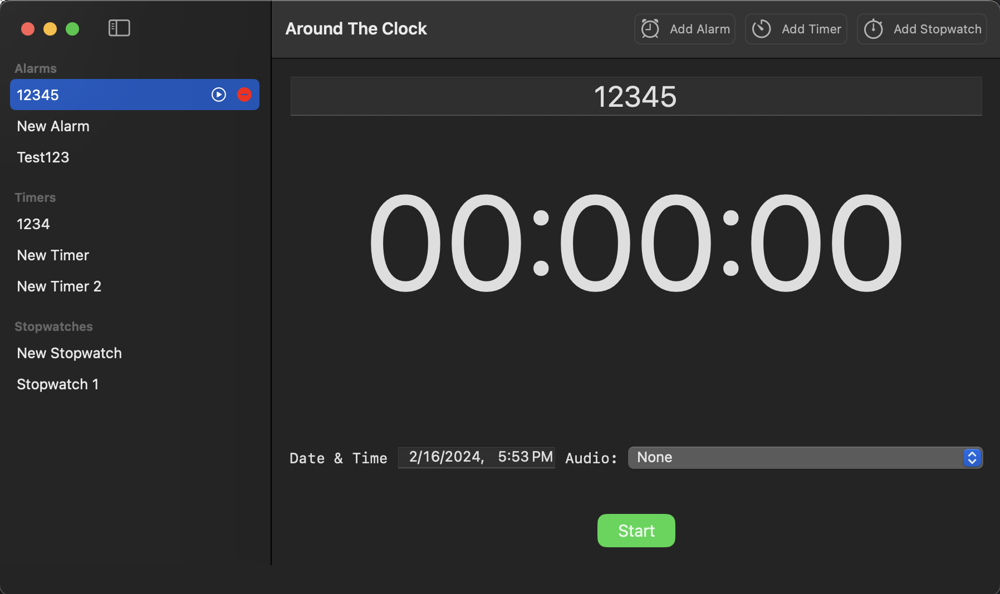
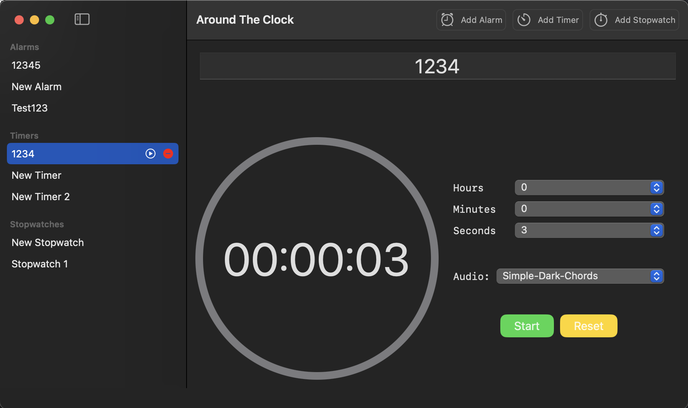
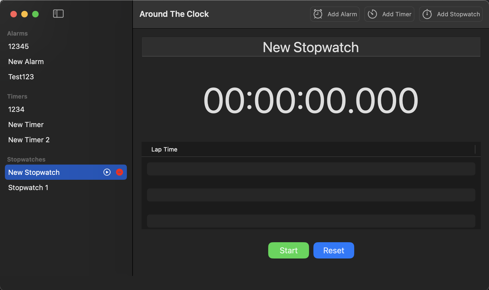

 [View on GitHub](https://github.com/RyanAngelo/around-the-clock){:target="_blank"}

[View Privacy Policy](/projects/aroundtheclock/privacy)

Back in the day, macOS did not have a time keeping or clock application included by default. I created Around The Clock to scratch my own itch to keep track of time spent on activities. Nowadays, I periodically update it to learn about new relevant frameworks and Swift/SwiftUI features.

Around the Clock is a simple, elegant time keeping application written in Swift for MacOS.

Around the Clock provides a stopwatch, a countdown timer, and an alarm clock in a clean interface.

### Release Notes
2/16/24 2.0.0 Updated to SwiftUI, reworking interface.

12/30/18 1.2.3 Fixed issue with keeping the window on top when the 'float on top' menu option is enabled.

12/30/18 1.2.1 Updated to support older versions of macOS (10.12+) and fixed naming issues.

12/28/18 1.2.0 Around the Clock supports Dark Mode in macOS Mojave and is available on the App Store.

[Back](/)
