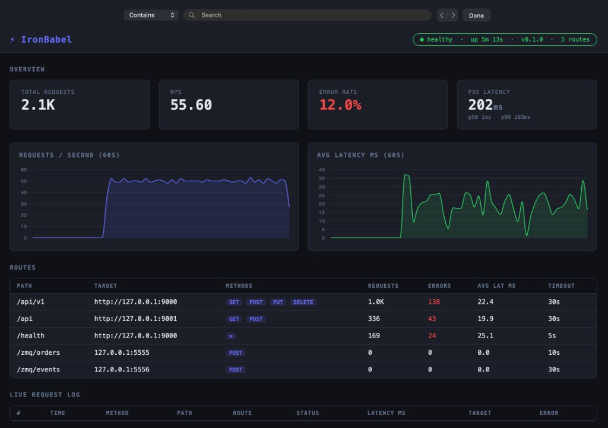

<span class="icon icon--github"></span> [View on GitHub](https://github.com/RyanAngelo/IronBabel){:target="_blank"}

Iron Babel is a cross-protocol API gateway written in Rust. The idea is to let services that speak different wire formats talk to each other without every team owning custom glue code: HTTP, GraphQL, gRPC, WebSockets, SSE, MQTT, and webhooks can be composed behind one configurable front door.

## Features

- **Protocol translation** between REST/HTTP and GraphQL or gRPC; WebSockets paired with HTTP/SSE or REST-style polling; MQTT paired with HTTP webhooks.
- **Schema work**: automatic discovery and generation so you are not hand-maintaining parallel definitions for every adapter.
- **Request/response transformation** for shaping payloads between backends and clients.
- **Developer-friendly configuration** via YAML/TOML files, environment variables, or command-line arguments.
- **Operations**: rate limiting and circuit breaking; metrics and health surfaced for day-two concerns.

## Monitoring

The gateway ships with a monitoring UI that summarizes health, version, route inventory, aggregate RPS and latency, and per-route stats (methods, targets, timeouts, errors). That makes it easier to see whether a slow path is the gateway or a downstream service before you dig into logs.



## Getting started

You need **Rust 1.75+**. From a clone of the repository:

```bash
cargo build
cargo test
```

### Try it with the built-in simulation

Use two terminals from the repo root. The gateway serves traffic; `load_gen` drives synthetic load so you can watch the monitoring dashboard respond.

In one terminal, start the gateway:

```bash
cargo run
```

In another, start the load generator:

```bash
cargo run --bin load_gen
```

Optional: tune request rate, errors, and slow responses:

```bash
cargo run --bin load_gen -- --rps 50 --error-rate 0.15 --slow-rate 0.1
```

For real deployments, point the process at your config (file, env, or flags) and register routes so the dashboard and metrics reflect actual traffic.

## Contributing and license

Contributions via pull requests are welcome. The project is released under the **MIT License** (see the repository’s `LICENSE` file).
