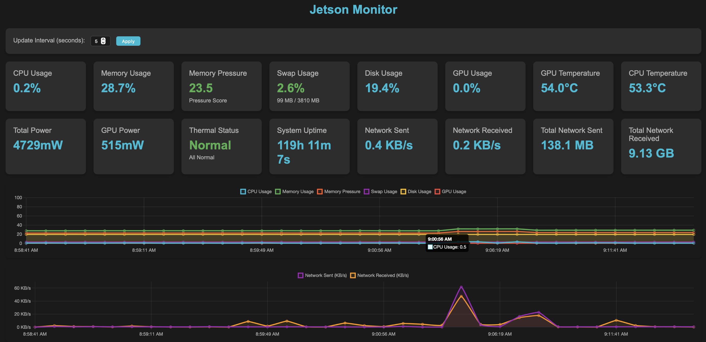

 [View on GitHub](https://github.com/RyanAngelo/jetson-monitor){:target="_blank"}

Jetson Monitor is a real-time web-based monitoring dashboard specifically designed for NVIDIA Jetson devices. This Flask-based application provides comprehensive system monitoring with a focus on the unique capabilities and thermal characteristics of Jetson hardware.

The project emerged from the need to monitor Jetson devices in real-time, particularly their thermal behavior and GPU utilization, which are critical for maintaining optimal performance in edge computing applications.

## Features

### System Monitoring
- **CPU & Memory**: Real-time CPU usage, memory consumption, and swap utilization
- **Storage**: Disk space monitoring with visual indicators
- **Network**: Live network throughput tracking (sent/received data rates)
- **Uptime**: System uptime tracking and display

### GPU Monitoring
- **GPU Utilization**: Real-time GPU usage percentages
- **GPU Temperature**: Continuous thermal monitoring
- **Power Consumption**: GPU and total system power draw tracking
- **Performance Metrics**: Comprehensive GPU performance data via NVIDIA ML

### Thermal Management
- **Thermal Status**: Real-time thermal state monitoring
- **Throttling Detection**: CPU and GPU throttling alerts
- **Visual Indicators**: Color-coded status system (Green/Yellow/Red)
- **Event Reporting**: Detailed thermal event logging

### Memory Pressure Analysis
- **Pressure Scoring**: Intelligent memory pressure calculation (0-100 scale)
- **Weighted Algorithm**: 
  - Memory usage (60% weight)
  - Swap usage (30% weight) 
  - Available memory (10% weight)
- **Visual Alerts**: Color-coded pressure indicators

## Technical Implementation

### Backend Architecture
The application is built with **Flask 3.0.2** and leverages several key libraries:
- **psutil 5.9.8**: System and process monitoring
- **nvidia-ml-py3 7.352.0**: NVIDIA GPU monitoring via NVML
- **Real-time Updates**: WebSocket-like updates via AJAX polling

### Frontend Design
- **Modern Dark Theme**: Responsive design optimized for monitoring scenarios
- **Interactive Charts**: Real-time data visualization with historical tracking
- **Mobile-Friendly**: Responsive layout that works on various screen sizes
- **Configurable Updates**: Adjustable refresh intervals (1-60 seconds)

### Data Visualization
- **Real-time Charts**: Interactive graphs showing the last 60 data points
- **Historical Tracking**: Persistent data visualization across sessions
- **Performance Metrics**: Visual representation of all monitored parameters

## Use Cases

This monitoring solution is particularly valuable for:
- **Edge Computing**: Monitoring Jetson devices in remote or embedded applications
- **Development**: Real-time performance analysis during application development
- **Thermal Analysis**: Understanding thermal behavior under different workloads
- **System Administration**: Remote monitoring of Jetson-based systems
- **Research**: Performance analysis for AI/ML workloads on edge devices

[Back](/)
