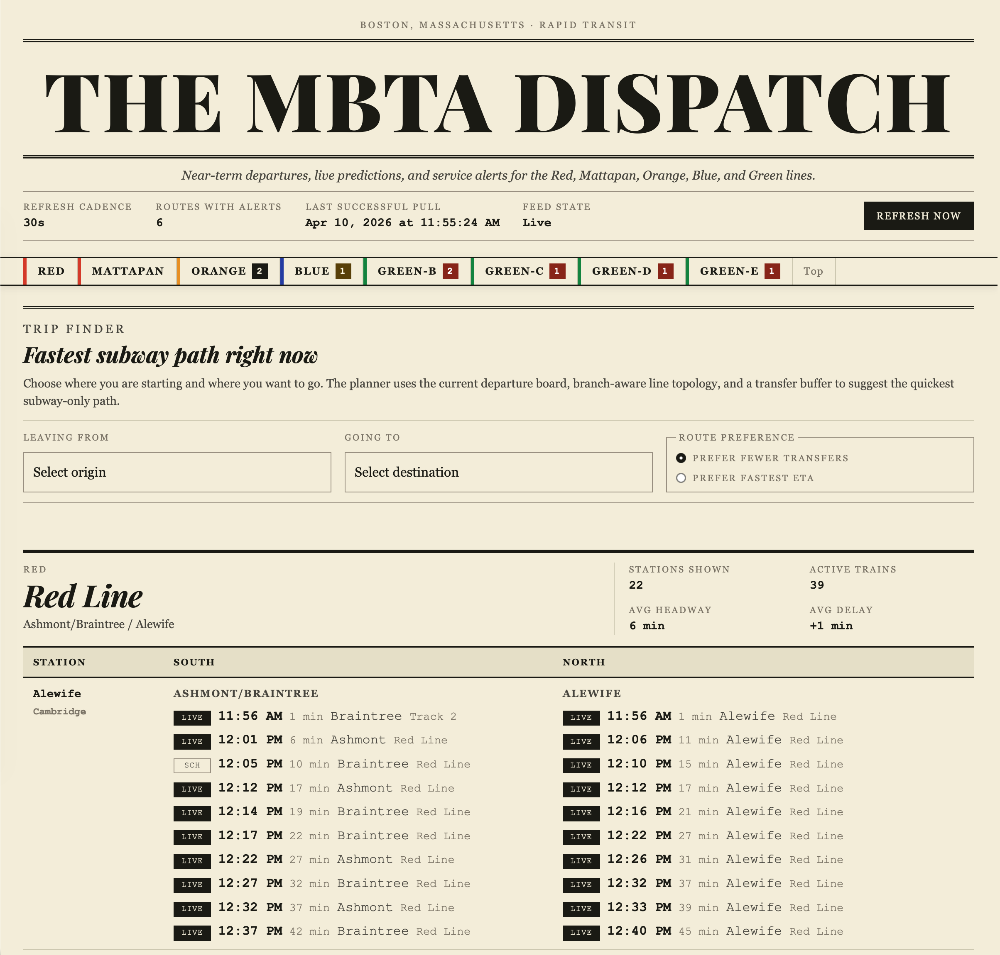

**MBTA Dispatch** is a text-heavy [Svelte](https://svelte.dev/){:target="_blank"} dashboard for Boston's MBTA subway. It pulls subway routes, station lists, live predictions, and published schedules from the [MBTA v3 API](https://www.mbta.com/developers/v3-api){:target="_blank"}, then shows a **per-line board** that refreshes on its own so you can skim arrivals without clicking around.

A **route finder** picks the fastest trip between a start and end location using the same live data: it factors in current service status, predictions, and other metrics so the suggested path reflects conditions on the ground—not just a static timetable.

The UI favors dense typography and clear columns over maps or heavy graphics—built for quick scanning at a desk or on a second screen.

[Back](/)
