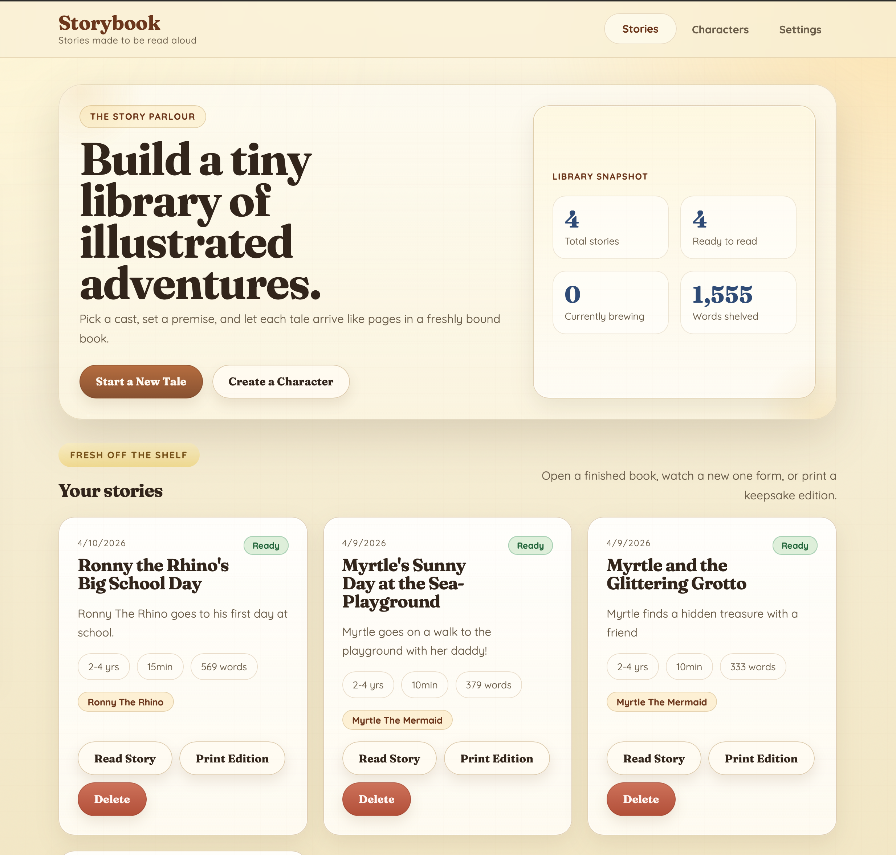

**Storybook** is a bedtime story generator for parents. You define **persistent characters** (name, traits, appearance, backstory), generate **age-appropriate** stories with an LLM, add **illustrations**, and **print** so kids can look at pictures while you read.

**Characters** — Create profiles once; after each story the app updates their history so later stories stay consistent.

**Stories** — Pick characters, set a premise, age range, and reading length. The model writes **page by page** with **safety checks** after each page before anything is saved.

**Print** — The print view interleaves text and image pages. With **duplex** printing, each illustration lands on the **back** of its text page: you read the front, kids see the art on the reverse. You can also save a PDF from the browser print dialog.

| Layer    | Technology                          |
| -------- | ----------------------------------- |
| Frontend | SvelteKit                           |
| Backend  | Node.js, Express, TypeScript        |
| Database | MongoDB, Mongoose                   |
| LLM      | Anthropic, OpenAI, or Ollama        |
| Images   | DALL-E 3 (OpenAI)                   |
| Ops      | Docker, docker-compose, nginx proxy |

The app is meant for **single-family self-hosted** use: there is **no authentication**. API keys live in environment variables at runtime, not in the database. Image generation uses OpenAI regardless of which provider generates text.

**Safety** — Each page is reviewed before it is kept; failed pages are regenerated (up to three tries) with feedback. Rules are enforced in system prompts, in post-generation review, and in image prompts (including negative keywords).

[Back](/)
